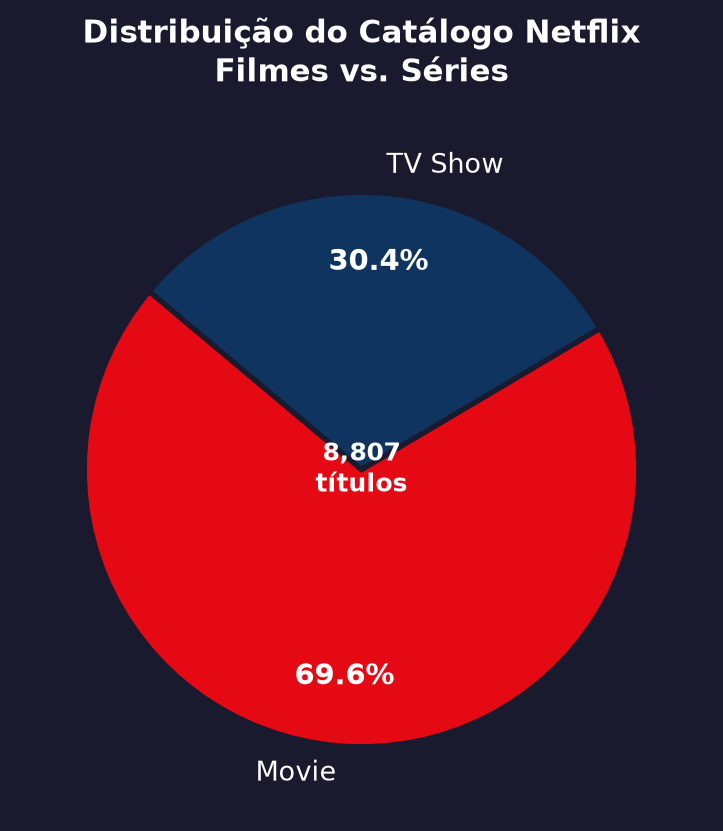
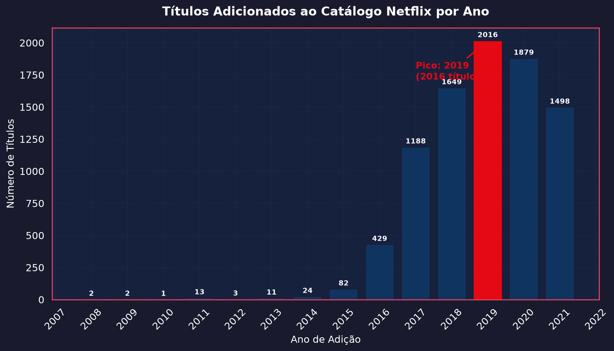
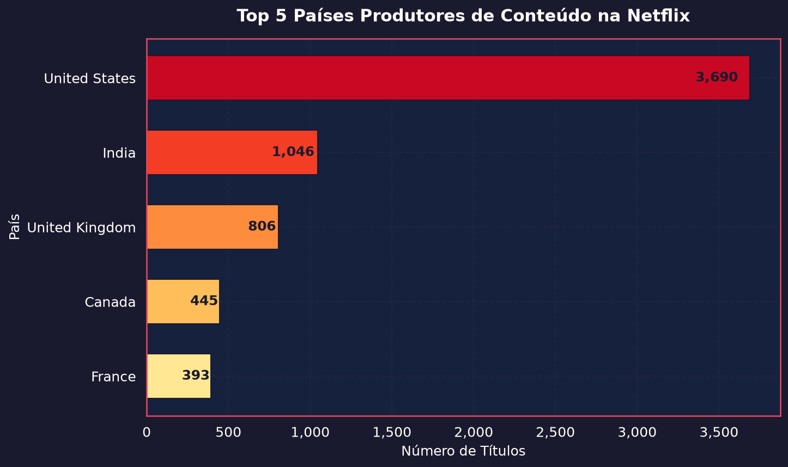
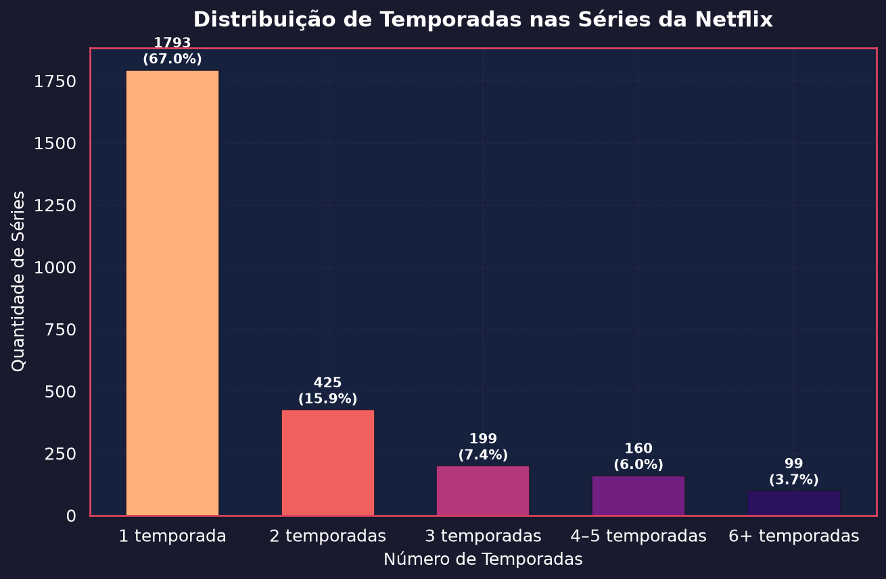
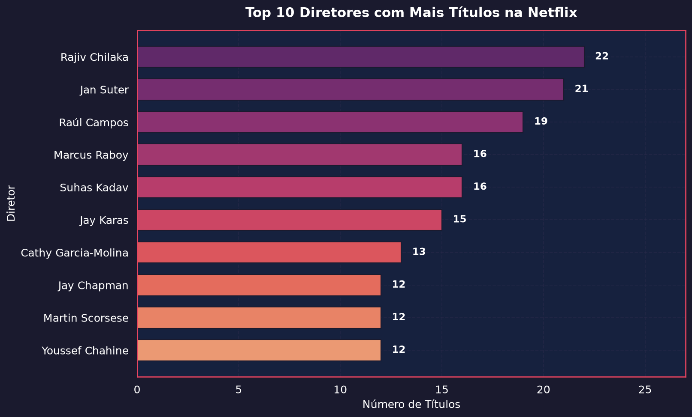
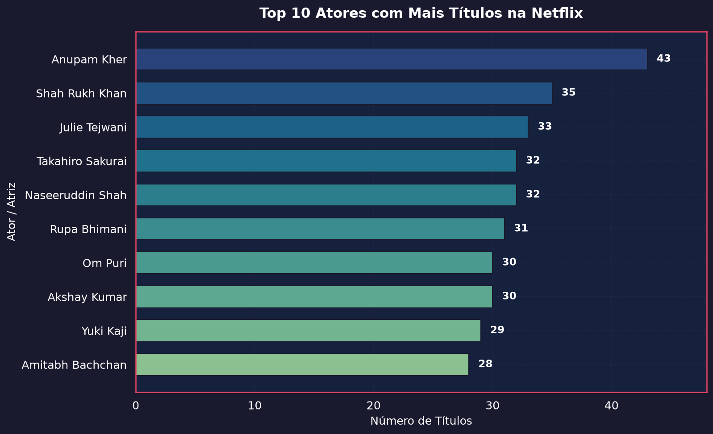

<div align="center">

# 🎬 Análise Exploratória de Dados — Catálogo Netflix


Análise exploratória do catálogo público da Netflix com foco em composição de conteúdo, tendências temporais, distribuição geográfica e protagonistas da plataforma.

</div>

---

## Sobre o Projeto

Este projeto aplica técnicas de **Análise Exploratória de Dados (EDA)** sobre o dataset público do catálogo Netflix para responder perguntas estratégicas de negócio. As análises são geradas via script Python modular e bem documentado, produzindo visualizações exportadas automaticamente.

## Estrutura do Projeto

```
projeto-data-analysis/
├── analysis.py            # Script principal — 5 análises independentes
├── netflix_titles.csv     # Dataset com 8.807 títulos
├── docs/
│   └── images/            # Gráficos gerados automaticamente
│       ├── 01_tipo_conteudo.png
│       ├── 02_ano_pico.png
│       ├── 03_paises_produtores.png
│       ├── 04_temporadas_series.png
│       ├── 05_top_diretores.png
│       └── 05_top_atores.png
└── README.md
```

## Dataset

| Atributo | Valor |
|---|---|
| **Fonte** | Kaggle — Netflix Movies and TV Shows |
| **Registros** | 8.807 títulos |
| **Colunas** | 12 |
| **Período coberto** | 2008 – 2021 |
| **Colunas-chave** | `type`, `title`, `director`, `cast`, `country`, `date_added`, `release_year`, `rating`, `duration` |

> **Qualidade dos dados:** `director` possui 2.634 valores nulos (~29,9%) e `country` possui 831 nulos (~9,4%). Ambos são tratados com `dropna()` nas funções correspondentes.

## Tecnologias

| Biblioteca | Finalidade |
|---|---|
| `pandas` | Ingestão, limpeza e manipulação tabular |
| `numpy` | Operações numéricas e suporte vetorial |
| `matplotlib` | Renderização e controle fino de layout |
| `seaborn` | Paletas, temas e estilos de visualização |

## Como Executar

```bash
# Clone o repositório
git clone https://github.com/seu-usuario/projeto-data-analysis.git
cd projeto-data-analysis

# Instale as dependências
pip install pandas numpy matplotlib seaborn

# Execute a análise completa
python3 analysis.py
```

Os gráficos serão salvos automaticamente em `docs/images/`.

---

## Análises e Insights

### 1. A Netflix é dominada por filmes ou séries?



| Tipo | Quantidade | Proporção |
|---|---|---|
| **Filmes** | **6.131** | **69,6%** |
| TV Shows | 2.676 | 30,4% |

Apesar da popularidade cultural de séries originais como *Stranger Things* e *La Casa de Papel*, o catálogo é majoritariamente composto por filmes — quase **7 em cada 10 títulos**. Esse dado reflete a estratégia histórica de licenciamento de bibliotecas cinematográficas legadas e a facilidade de aquisição de conteúdo de formato fechado em escala global.

---

### 2. Qual foi o ano de pico de adições ao catálogo?



| Ano | Títulos Adicionados |
|---|---|
| 2017 | ~1.200 |
| 2018 | ~1.540 |
| **2019** | **2.016 — pico histórico** |
| 2020 | ~1.879 |
| 2021 | ~1.498 *(parcial — até set/2021)* |

O ano de **2019** marcou o pico de aquisição com **2.016 títulos** (~168/mês). O contexto é crítico: Disney+ e Apple TV+ foram lançados em novembro e outubro de 2019, respectivamente. A aceleração de 2018–2019 indica uma resposta estratégica antecipada à chegada de grandes concorrentes. A retração em 2020 é atribuída à paralisação de produções durante a pandemia de COVID-19.

---

### 3. Quais são os 5 países que mais produzem conteúdo?



| # | País | Títulos |
|---|---|---|
| 🥇 | 🇺🇸 United States | 3.690 |
| 🥈 | 🇮🇳 India | 1.046 |
| 🥉 | 🇬🇧 United Kingdom | 806 |
| 4° | 🇨🇦 Canada | 445 |
| 5° | 🇫🇷 France | 393 |

> **Metodologia:** co-produções são contabilizadas uma vez por país via `explode()` na coluna `country`.

Os **Estados Unidos** respondem por mais de **40% do catálogo**. A **Índia em 2° lugar** é notável — reflexo direto do volume de Bollywood e do investimento estratégico da Netflix no mercado sul-asiático. O ranking é composto integralmente por países do hemisfério norte com predominância anglófona, sinalizando lacunas em mercados como Brasil, Coreia do Sul e México.

---

### 4. A maioria das séries termina na 1ª temporada?



| Temporadas | Séries | Proporção |
|---|---|---|
| **1 temporada** | **1.793** | **67,0%** |
| 2 temporadas | 404 | 15,1% |
| 3 temporadas | 208 | 7,8% |
| 4–5 temporadas | 171 | 6,4% |
| 6+ temporadas | 100 | 3,7% |

**67% das séries encerram na primeira temporada.** Esse padrão aponta para um catálogo predominantemente composto por minisséries, docusséries e conteúdo internacional de temporada única. Apenas ~10% das séries atingem 4 ou mais temporadas, evidenciando que a longevidade é exceção — e não regra — na plataforma. Isso pode refletir tanto uma estratégia de *breadth* (variedade) quanto altas taxas de cancelamento de produções originais.

---

### 5. Quais diretores e atores mais aparecem na plataforma?

#### Top 10 Diretores



**Rajiv Chilaka** lidera com **22 títulos** — diretor indiano de animações infantis, responsável pela franquia *Chhota Bheem*. Sua presença no topo reforça o peso da produção indiana no catálogo e o foco da Netflix em conteúdo infantil localizado.

#### Top 10 Atores/Atrizes



**Anupam Kher** lidera com **43 aparições** — veterano ator indiano com décadas de carreira em Bollywood. A predominância de atores indianos no ranking confirma o volume expressivo da produção da Índia no catálogo global da plataforma.

> **Nota metodológica:** a análise de `cast` foi realizada via `explode()` na coluna separada por vírgulas. Variações de grafia podem fragmentar a contagem de alguns nomes.

---

## Observações Complementares e Próximas Análises

Os insights extraídos abrem portas para investigações mais aprofundadas:

**📈 Competição no mercado de streaming**
O pico de 2019 coincide com o lançamento de Disney+ e Apple TV+. Uma análise longitudinal segmentada por tipo de conteúdo (filmes vs. séries) pode revelar se houve mudança estratégica na composição do catálogo como resposta competitiva.

**🌍 Internacionalização geográfica**
O domínio dos EUA (>40%) contrasta com a estratégia de expansão global da Netflix. Mapear a evolução da participação de cada país por ano pode evidenciar quando mercados emergentes como Brasil, Coreia do Sul e México ganharam relevância no catálogo.

**📺 Cancelamento vs. renovação de séries**
Separar séries originais Netflix de conteúdo licenciado é essencial para entender os 67% de séries com apenas 1 temporada. Uma análise cruzando rating etário e longevidade pode revelar se produções para públicos mais maduros (TV-MA) tendem a ser renovadas com mais frequência.

**🎭 Gêneros e sazonalidade**
Cruzar gêneros com país de produção e período de adição pode identificar tendências temáticas por mercado e detectar sazonalidade nas aquisições (ex: volumes maiores em períodos pré-festivos).

**🔎 NLP nas sinopses**
Aplicar análise de sentimento e *topic modeling* na coluna `description` pode revelar mudanças nas tendências narrativas ao longo do tempo — por exemplo, se o conteúdo adicionado pós-2018 é tematicamente mais sombrio ou diverso.

---

<div align="center">
  <sub>Desenvolvido com Python · Pandas · Matplotlib · Seaborn</sub>
</div>
